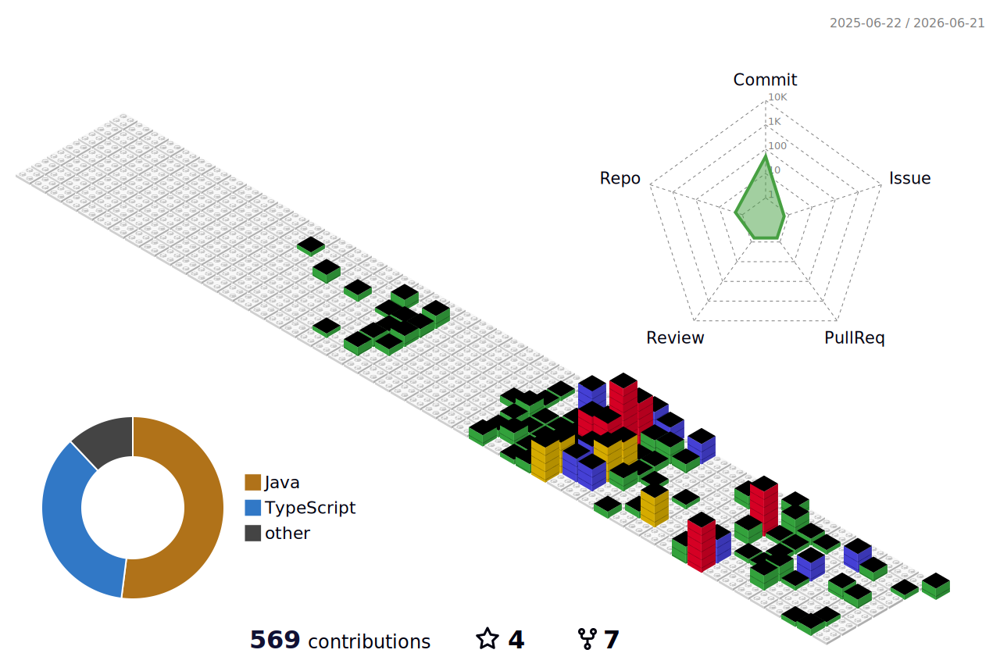

   

##

  
     
   
   

|  |  |
| :-: | :-: | 

|  |  |  |
| :-: | :-: | :-: | 

##

 

  

  
##

  <h3>My Stacks</h3>

  <h4>Backend</h4>
  

    
    
    
    
    
    
  

  <h4>Frontend</h4>
  

    
    
    
    
    
    
    
  

  <h4>DevOps & Cloud</h4>
  

    
    
    
    
    
    
    
  

  <h4>Database</h4>
  

    
    
    
    
    
  

  <h4>Tools</h4>
  

    
    
    
    
    
    
    
  

##
     

<h3> My Contacts </h3>

  
  
  
   

##

   </a>

##

<picture>
  <source media="(prefers-color-scheme: dark)" srcset="https://raw.githubusercontent.com/wolwerr/wolwerr/output/github-contribution-grid-snake-dark.svg">
  <source media="(prefers-color-scheme: light)" srcset="https://raw.githubusercontent.com/wolwerr/wolwerr/output/github-contribution-grid-snake.svg">
  
</picture>

##  GitHub Trophies
     

##

     
##

